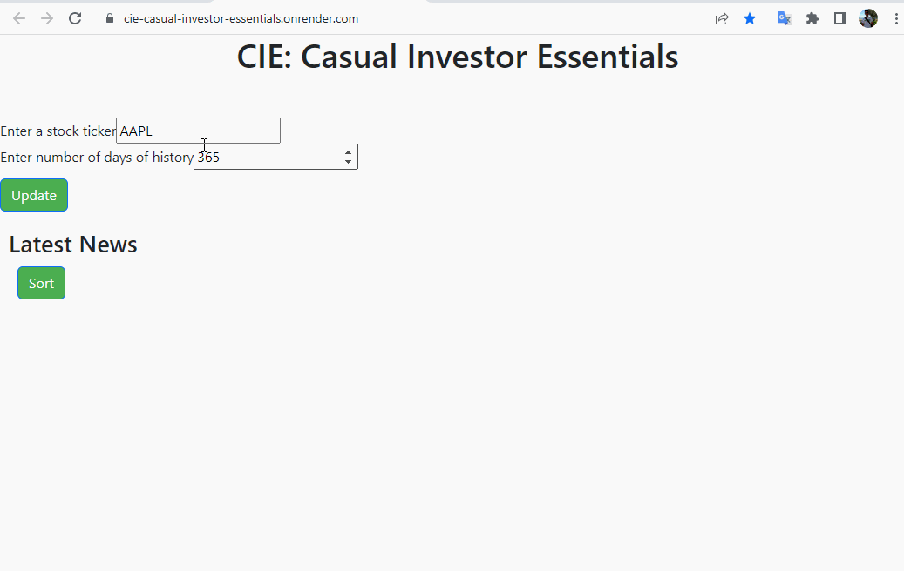

# CIE-Casual-Investor-Essentials

-   authors: Ruslan Dimitrov

# Table of Contents


-   [Motivation and research questions](#Motivation-and-research-questions)
-   [Description of the app](#Description-of-the-app)
-   [Installation](#Installation)
-   [Get Involved](#Get-Involved)
-   [Contact us](#Contact-us)
-   [License](#license)


## Motivation and research questions

The main target audience of the app is casual investors with limited access to financial data who are interested in monitoring companies in which they are interested in investing or in which they currently own shares.

The main research questions addressed by CIE-Casual-Investor-Essentials are:

- At what prices is my stock of interest trading today?
- What has been the stock price closing level over the past days, months, years?
- What news articles are published on this stock recently?
- What can each news article tell me about the changes the stock is experiencing?

## Description of the app

Based on the author's experience and aim of this app, it combines the best source of stock data (Yahoo Finance) and the best source of aggregated news (Google News) in one app cleared of all the advertising noise and clutter of the interet.  The app gives the user a quick glance on the latest stock price and news articles associated with their stock of interest. 

Specifically, this app contains one plot and one table:

- The plot presents a history of the daily closing price of a stock.   
- The table contains four columns including the title of the article, a source of the article, the date of publishing, and a link to the source of the article.

The app contains three reactive elements and two update buttons:
- An input field where the user can enter the stock ticker of interest
- An input field where the user can enter the number of days for which they would like to see the history of the stock price.
- A drop-down menu from which the user can select to sort the articles in terms of relevance and in terms of recency.
- An update button from which the user can reload both the plot and the news articles table after entering new stock ticker or time period.
- A sort button above the table from which the user can sort the articles by most recent or by source.

This structure is laid out in a simplified one page format with conservative design choices aimed to minimize the cognitive load of the target user who is expected to be an active screen user during his daily life.




## Usage and Installation

The CIE app can be accessed on render at the following [link](https://cie-casual-investor-essentials.onrender.com/)

To install `CIE-Casual-Investor-Essentials` locally, you can:

1. Clone this repository with:

```
git clone https://github.com/RussDim/CIE-Casual-Investor-Essentials.git
```

2. Packages used in by the app:

```{Python}
pandas ~= 1.3.5
dash ~= 2.8.1
dash_bootstrap_components ~= 1.4.0
plotly ~=5.13.1
yfinance ~=0.2.12
requests ~=2.28.2
```

3. Finally, move to the `src` directory and run the following command to run the app locally:

```{Python}
python app.py
```

## Get Involved

If you are interested in contributing to the app we welcome to share your thoughts. Particularly we would appreciate:

-   Additional data. This app is constantly evolving and being updated with new data. If you posses data related to Data Science salaries that can be applied to this App we would highly appreciate your contribution.

## Contact us

If you would like to help with the development of this Dash app feel free to contact us after referring to our [contributor's guidelines](CONTRIBUTING.md)

## License

Licensed under the terms of the [MIT license](LICENSE).
